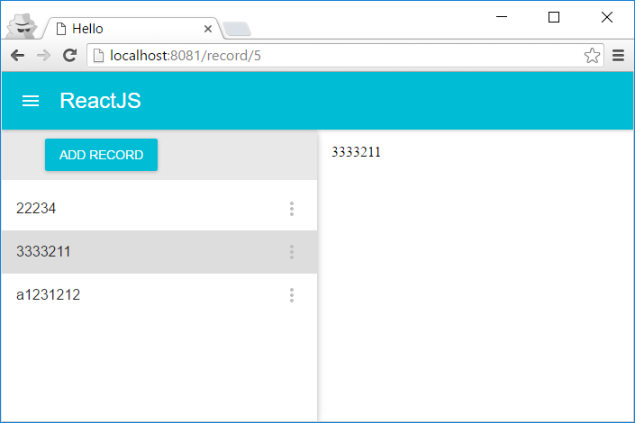
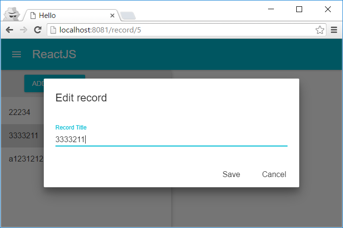

# react-redux-express-webpack-immutable-material
ReactJS + Redux + ExpressJS + WebPack + ImmutableJS + Grunt + Hot reload + Material UI boilerplate project

!!! requires NodeJS 6.x

Complete flow containing application which can read / create / update / delete records based on Material UI components with validation.

Used tools / technologies / languages:

* [JavaScript ES6](https://github.com/lukehoban/es6features)
* [ReactJS](https://facebook.github.io/react/)
* [Redux](https://github.com/reactjs/redux)
* [ExpressJS](https://expressjs.com/) for backend
* [BabelJS](https://babeljs.io/)
* [WebPack](https://webpack.github.io/) (as Grunt task) with hot module reload
* [ImmutableJS](https://facebook.github.io/immutable-js/)
* [MaterialUI](http://www.material-ui.com/)
* simple [REST controllers](https://github.com/olegccc/rest-controllers) for ExpressJS
* [GruntJS](http://gruntjs.com/)
* [PreCSS](https://github.com/jonathantneal/precss)
* [PostCSS](https://github.com/postcss/postcss)
* [React Router](https://github.com/reactjs/react-router)
* [Redux Logger](https://github.com/evgenyrodionov/redux-logger)
* [Redux Thunk](https://github.com/gaearon/redux-thunk)
* [fetch polyfill](https://github.com/github/fetch)
* [Jade](http://jade-lang.com/)
* [Async/await for backend](https://github.com/yortus/asyncawait)
* [Async/await for frontend](https://ponyfoo.com/articles/understanding-javascript-async-await)
* [CSS autoprefixer](https://github.com/postcss/autoprefixer)
* [Colorguard](https://github.com/SlexAxton/css-colorguard)
* [Lodash](https://lodash.com/)
* [Font magician](https://github.com/jonathantneal/postcss-font-magician)
* [Tingodb](http://www.tingodb.com/) just as simplest option to provide minimal database features

## Run commands

To run in debug mode, use the following command:

```grunt api serve```

And open browser at http://localhost:8080

To build release version, use the following command:

```grunt release api:wait```

And open browser at http://localhost:8081

## Screenshots



